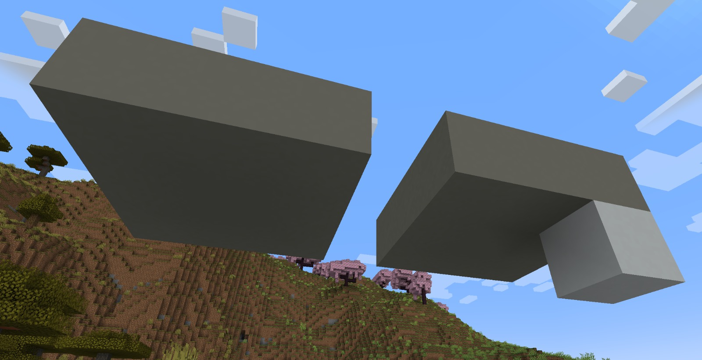

# Rapport de projet - Voxel engine & Algorithmes de Markov

> Victor CARO & Victor LLORCA

## Introduction
Nous avons choisi dans ce projet de mettre en œuvre de la génération procédurale à l’aide d’un système de gestion de voxel (pixel de volume) et de règles de génération issues des algorithmes de Markov.

Afin de présenter ce projet, nous avons placé cette scène dans un contexte citadin, une voiture pouvant se déplacer sur des routes longeant des parcelles générées grâce à des algorithmes de Markov.

## 1 - Le voxel engine
Un voxel engine est une manière d’afficher des paysages constitués de blocs. Les trois éléments principaux d’un voxel engine sont :

### 1.a) Les blocs (ou voxel)
Dans notre projet, le monde est entièrement rempli par des blocs. Un bloc est juste une représentation en mémoire contenant un type qui définit la manière dont l’espace qu’il occupe doit être rempli. Le type d’un bloc sert également à l’algorithme de Markov.
Le type le plus important est le type `BlockType_Empty`, il désigne l'absence de remplissage “physique”.

### 1.b) Les chunks
Un chunk est un regroupement de `(l * L * h)` blocs. Dans notre version finale un chunk est un regroupement de 16 * 16 * 16 = 4 096 blocs.
C’est dans le chunk qu’une première partie graphique intervient. A chaque chunk est attribué un maillage qui sera ensuite chargé ou non. Le calcul du maillage fait intervenir une méthode appelée “Face culling” pour éviter d’inclure des triangles inutiles. Le principe repose sur le fait que si deux blocs (non vide) partagent une même face alors cette face n’est pas visible par l’utilisateur.
### 1.c) Le chunk manager
C’est le chunk manager qui est responsable de créer les chunks au fur et à mesure que le joueur se déplace et de les garder en mémoire. Si des chunks sont trop loin (par rapport à une certaine `RENDER_DISTANCE`) alors il les décharge pour éviter que la carte graphique soit trop encombrée. Pour éviter d’avoir des conflits lors de la génération aléatoire, les chunks en train d’être générés par méthode de Markov ne sont pas rendus mais continuent d’être mis à jour s’ils sortent que la `RENDER_DISTANCE`.
## 2 - Les algorithmes de Markov
La structure la plus simple utilisée par les algorithmes de Markov est la notion de règle. Une règle est simplement définie par une condition d’application, et une fonction d’application. Elle permet de transformer un ensemble de voxel en un autre.
Par exemple, afin de commencer les piliers d’une maison, on souhaite remplacer le motif de gauche par le motif de droite. Concrètement, on place un pilier blanc sous un bloc gris qui n’a que 2 voisins



Un ensemble de règles est appelé une règle de Markov. Elle s’applique selon la façon suivante : 
```
Application(Chunk C, int limit)
	L = []
	Pour chaque règle simple r de la règle de Markov:
		Pour chaque position (x, y, z)
			Si la règle r s’applique et dans la limite de limit éléments
				Ajouter (r, x, y, z) à L
	Appliquer toutes les règles de L
```

En combinant des règles de Markov entre elles, on obtient un algorithme de Markov, capable de générer des structures complexes et aléatoires. Le caractère aléatoire de ces structures provient de choix aléatoires d’application de règles de Markov, mais aussi dans l’énumération aléatoire des positions (x, y, z) dans l’application de chaque règle de Markov.

Ce processus peut devenir relativement coûteux en fonction du nombre de règles, car il faut explorer chaque voxel pour chaque règle entre deux mises à jour. Afin d’optimiser ces calculs, il est important de s’assurer dans la fonction de test d’application de renvoyer la réponse en un nombre minimal d’opérations.

Une technique courante dans les algorithmes de Markov

Le code propose ici 5 modèles de Markov : 
- Une maison moderne, définie par des cubes empilés les uns sur les autres, et donc les parties volantes sont soutenues par des piliers
- Un arbre, donc la taille et l’expansion du feuillage sont aléatoires
- Une rivière, issue de la rencontre de deux processus expansifs aléatoires de terrain, qui sont ensuite surélevés aléatoirement
- Un labyrinthe 3D, généré à partir d’une simple règle qui transforme un motif BNN en motif BGB (B = blanc, N = noir, G = gris)
- Un serpent multicolore, qui se construit comme une marche aléatoire dans le chunk jusqu’à être bloqué
